# ArtisanGo

ArtisanGo is a Flutter mobile application designed to connect customers with local artisans in Morocco.

The application allows users to discover artisans and their services, view ratings and reviews, save favorites, share services, and contact artisans directly through WhatsApp.

## Features

- User registration and authentication
- Search and filtering of artisans and services
- Service details and reviews
- Favorites management
- Artisan service publishing
- Geolocation and "Near Me" functionality
- Direct contact through WhatsApp
- French and English language support
- Light and dark mode
- Image upload and management

## Technologies

- Flutter / Dart
- Firebase Authentication
- Cloud Firestore
- Cloudinary
- Geolocator
- SharedPreferences
- Easy Localization

## Screenshots

### Authentication


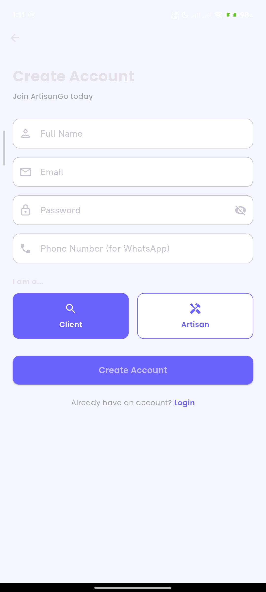

### Home and Search

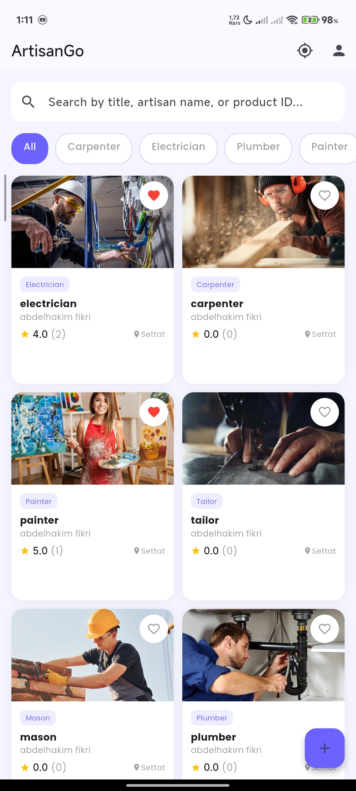
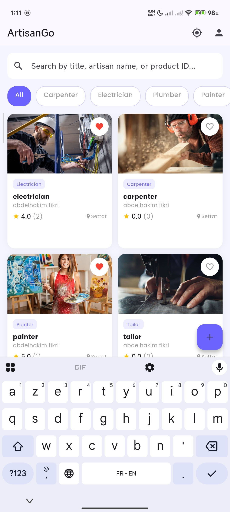

### Service Management

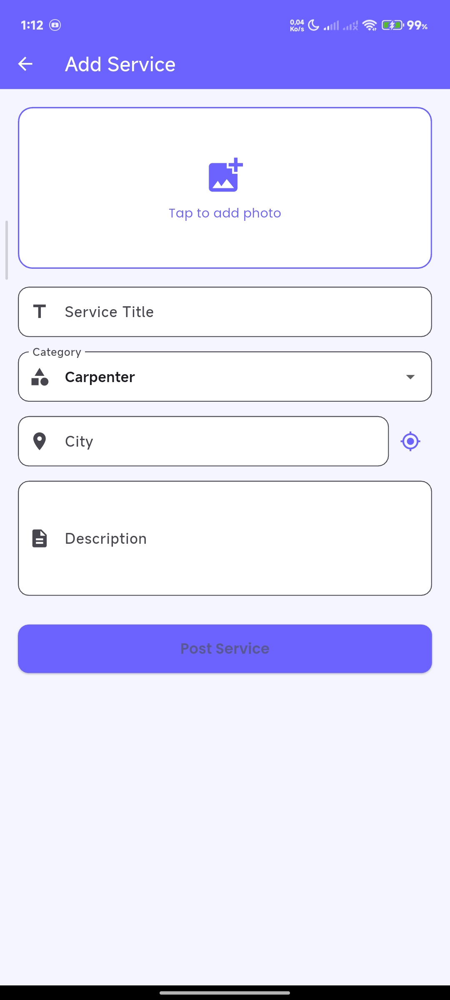
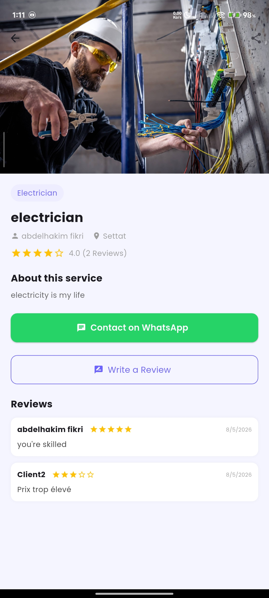


### User Features

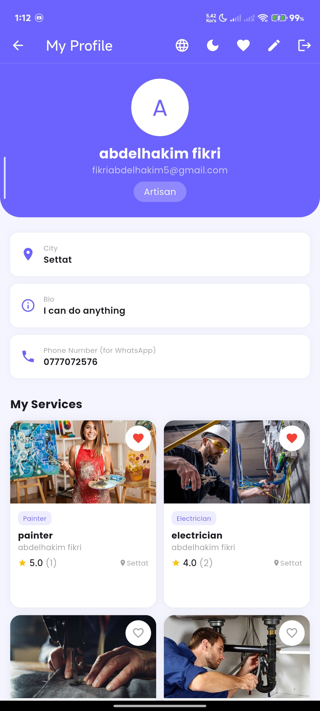
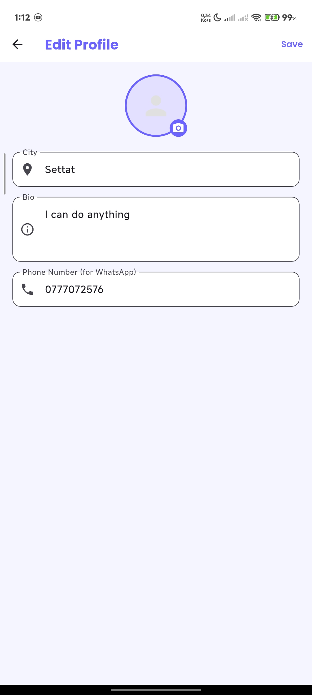
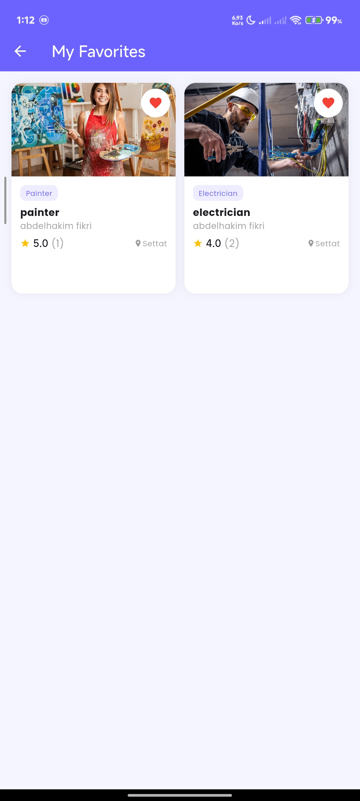
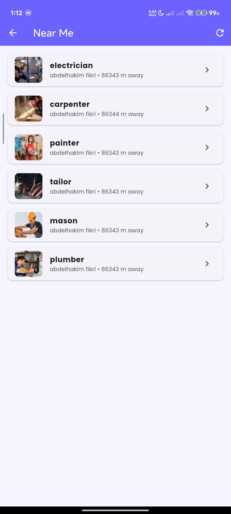

### Additional Features

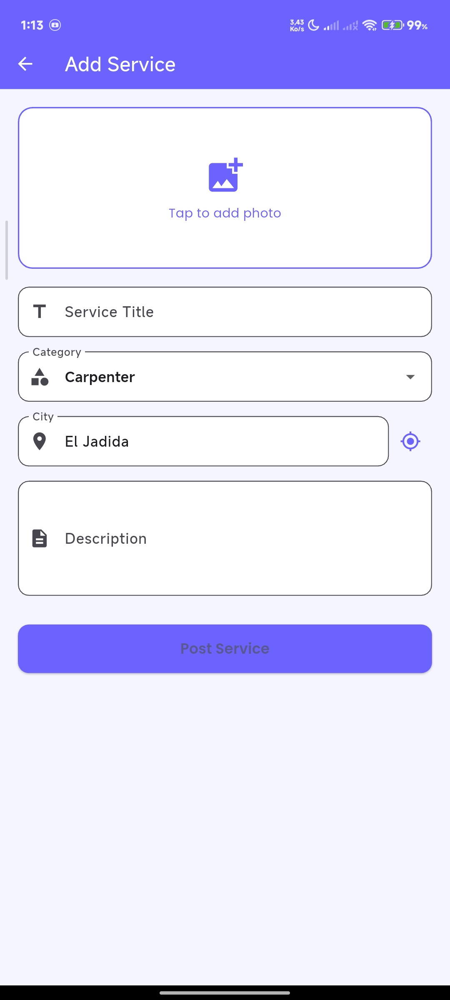
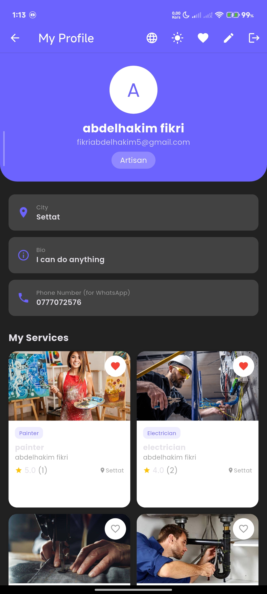
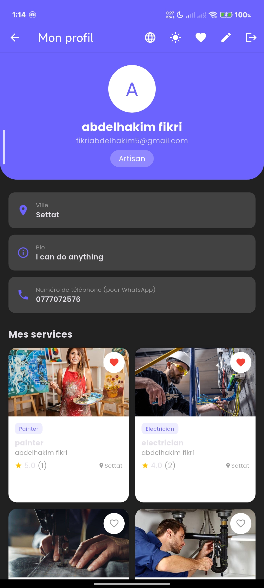

## Project Structure

```text
lib/
├── screens/
├── widgets/
├── services/
├── models/
├── translations/
└── main.dart